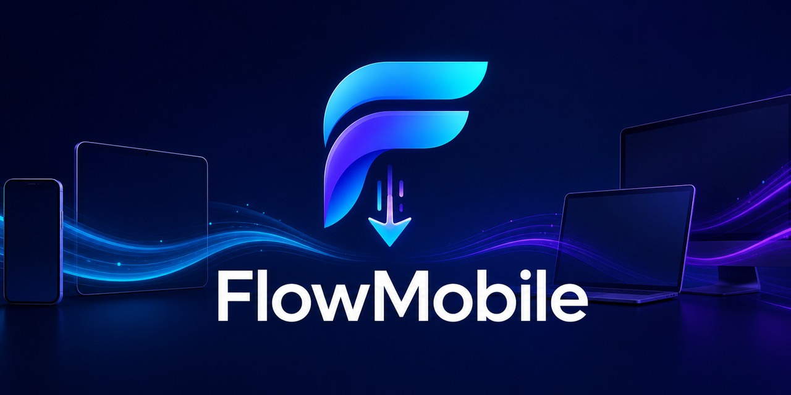

# FlowMobile

  

Descarga vídeos o extrae audio desde **iOS, Android, Windows y Linux**.
El comando para abrir la aplicación es `flow`.

Versión actual: **8.0.2**.

> **Repositorio oficial:** `tacosandtypescript-debug/FlowMobile`.

## Instalar

### iPhone o iPad · a-Shell

### Android · Termux

### Windows Terminal y Linux

1. Pulsa el botón de tu dispositivo y toca **Copiar**.
2. Pega el comando en la terminal indicada.
3. Cuando termine, abre una ventana nueva y escribe `flow`.

El instalador muestra seis pasos simples y, si falla, explica la causa exacta
sin llenar la terminal de salida técnica.

Si el botón no abre, usa el respaldo para
[iPhone/iPad](docs/COPIAR_IOS.md), [Android](docs/COPIAR_ANDROID.md),
[Windows](docs/COPIAR_WINDOWS.md) o [Linux](docs/COPIAR_LINUX.md).

## Funciones principales

- Vídeo desde 360p hasta 2160p y mejor calidad disponible.
- Audio automático, M4A o MP3.
- YouTube, TikTok, Facebook, Instagram, X y otras 30 plataformas.
- Historial, lotes, playlists, reanudación y cancelación limpia.
- Compartir archivos y mostrarlos en la galería de Android.
- Cookies privadas, actualizaciones, diagnóstico y modo de reparación.

## Dónde aparecen las descargas

| Dispositivo | Vídeos | Audios |
|---|---|---|
| iPhone/iPad | `FlowMobile/Downloads` | `FlowMobile/Downloads` |
| Android | `Movies/FlowMobile` | `Music/FlowMobile` |
| Windows | `Downloads/FlowMobile/Videos` | `Downloads/FlowMobile/Audio` |
| Linux | `Downloads/FlowMobile/Videos` | `Downloads/FlowMobile/Audio` |

## Ayuda y documentación

- [Guía completa](docs/GUIA_COMPLETA.md)
- [Reportar un error o sugerir una mejora](https://github.com/tacosandtypescript-debug/FlowMobile/issues)
- [Última versión estable](https://github.com/tacosandtypescript-debug/FlowMobile/releases/latest)
- [Pruebas en dispositivos](docs/DEVICE_TESTING.md)
- [Seguridad](SECURITY.md)
- [Cambios por versión](CHANGELOG.md)
- [Licencia y usos permitidos](LICENSING.md)

FlowMobile 7.6.14 y posteriores permiten uso personal no comercial, pero no
redistribución ni modificaciones sin autorización. Consulta también la
[política de marca](TRADEMARKS.md).
